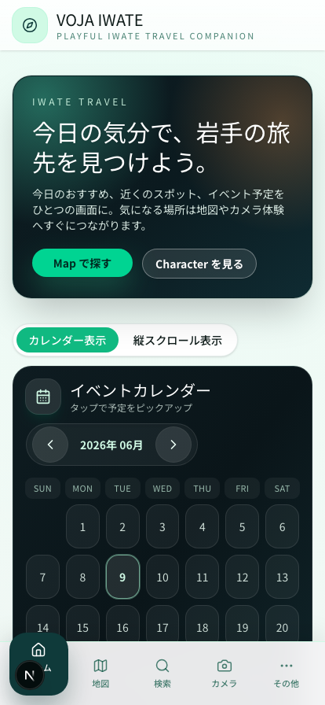
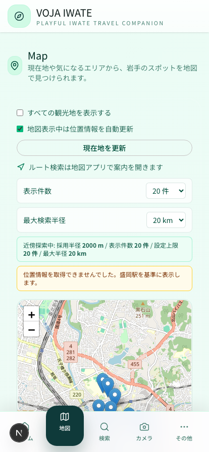
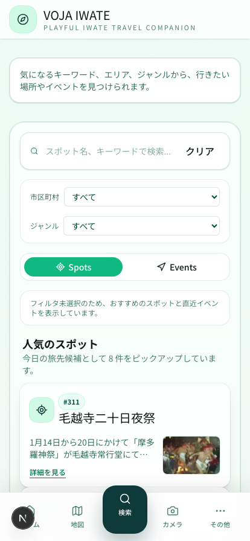
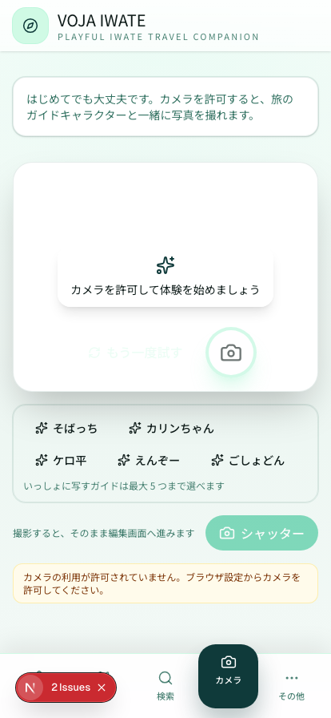
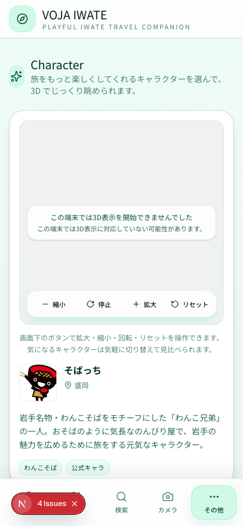
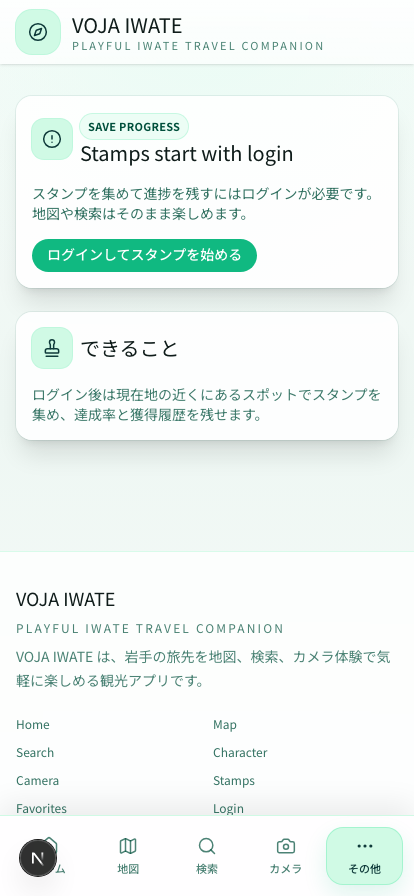

# VOJA IWATE

**VOJA IWATE** は、岩手の旅をもっと身近に楽しむための観光アプリです。
地図・検索・カメラ体験を通して、「今いる場所」や「今日の気分」にぴったりの旅先をすばやく見つけられます。

スマートフォンでもPCでも、ブラウザを開くだけですぐに使えます。

  
  
  

---

## できること

### 🗓 今日の気分で旅先を見つける（ホーム）

岩手のイベントやおすすめスポットを、カレンダー形式でひと目で確認できます。
気になる日付や予定をタップすると、そのまま詳細・地図・カメラ体験へ進めます。

### 🗺 近くのスポットを地図で探す（地図）

現在地のまわりにある観光スポットを地図上に表示します。
表示する件数や検索範囲（半径）を自由に調整でき、気になる場所はそのまま地図アプリでルート案内へつなげられます。

### 🔍 キーワード・エリア・ジャンルで検索（検索）

行きたい場所やイベントを、キーワード・市区町村・ジャンルから検索できます。
まだ条件を決めていなくても、今日のおすすめスポットや直近のイベントを提案してくれます。

### 📸 ゆるキャラと一緒に写真を撮る（カメラ）

カメラを許可すると、岩手のガイドキャラクターと一緒に写真が撮れます。
そばっち・カリンちゃん・ケロ平など、お気に入りのキャラクターを最大5体まで選んで撮影。
撮った写真はその場で編集して、SNSでシェアできます。

### 🧸 ゆるキャラをじっくり眺める（キャラクター）

岩手のゆるキャラを3Dモデルで表示。拡大・縮小・回転で好きな角度から眺められます。
それぞれのキャラクターの由来やプロフィールも読めます。

### 🏅 スタンプを集めて旅の記録を残す（スタンプ）

ログインすると、観光スポットの近くでスタンプを集められます。
達成率や獲得履歴が残るので、岩手を巡った思い出をコレクションとして楽しめます。

---

## 使い方

1. アプリを開くと、最初に簡単な使い方ガイド（オンボーディング）が表示されます。
2. 画面下のメニューから **ホーム / 地図 / 検索 / カメラ / その他** をいつでも切り替えられます。
3. **地図・検索・カメラ・スポット詳細** は、ログインなしですぐに利用できます。
4. **スタンプ収集やお気に入りの保存** など、記録を残す機能を使うときだけログインを促します。

> 📱 スマートフォンでの利用を第一に設計していますが、PCのブラウザにも対応しています。

---

## こんなときに

- 岩手に旅行に行く前に、行き先の候補を探したい
- 旅行中に、今いる場所の近くにある観光スポットを知りたい
- 旅先で、ゆるキャラと記念写真を撮りたい
- 訪れた場所をスタンプで記録して、旅の思い出を残したい

---

## 開発者向け情報

ローカルでの起動方法や技術的な詳細は **[docs/DEVELOPMENT.md](docs/DEVELOPMENT.md)** を参照してください。

## ライセンス

依存物・画像・3Dモデルの権利確認中のため、ライセンスは未確定です。
